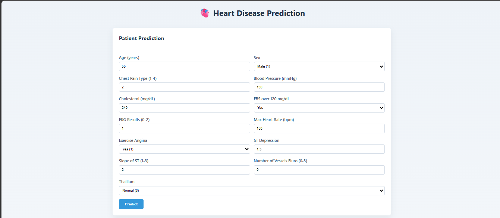
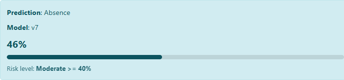
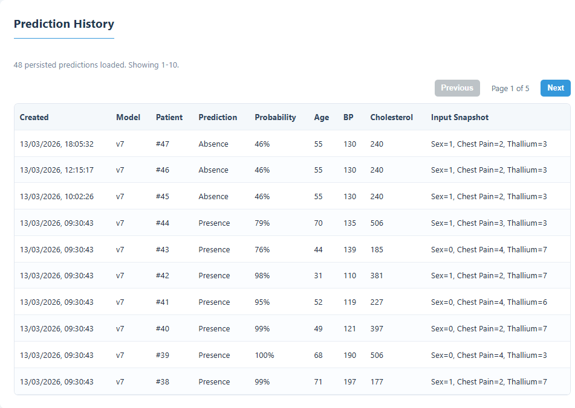
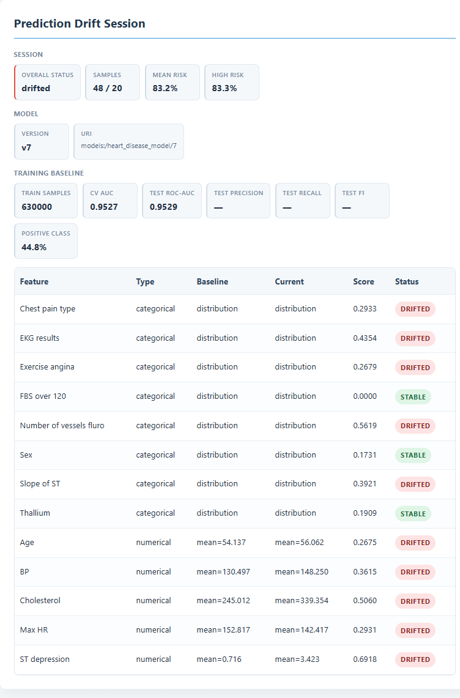
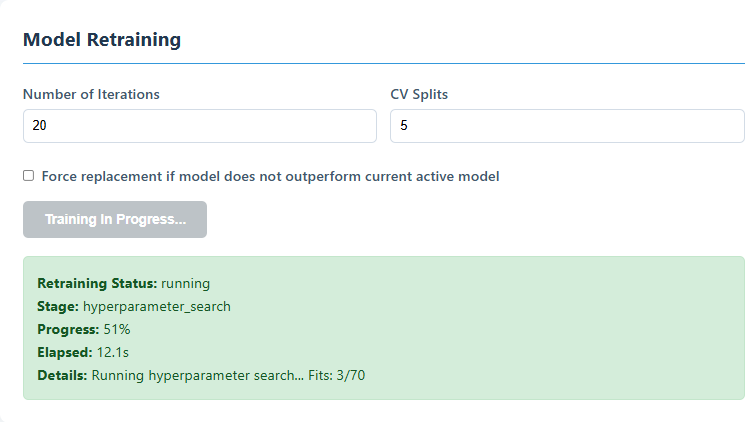
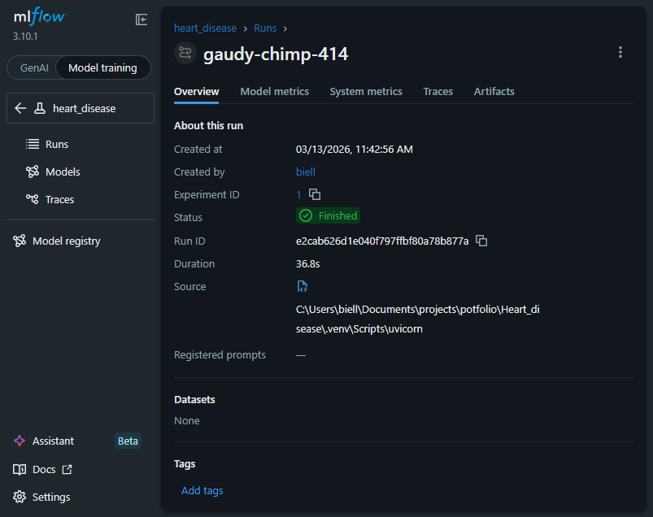
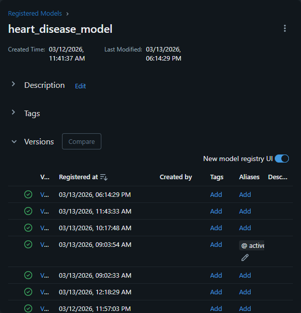
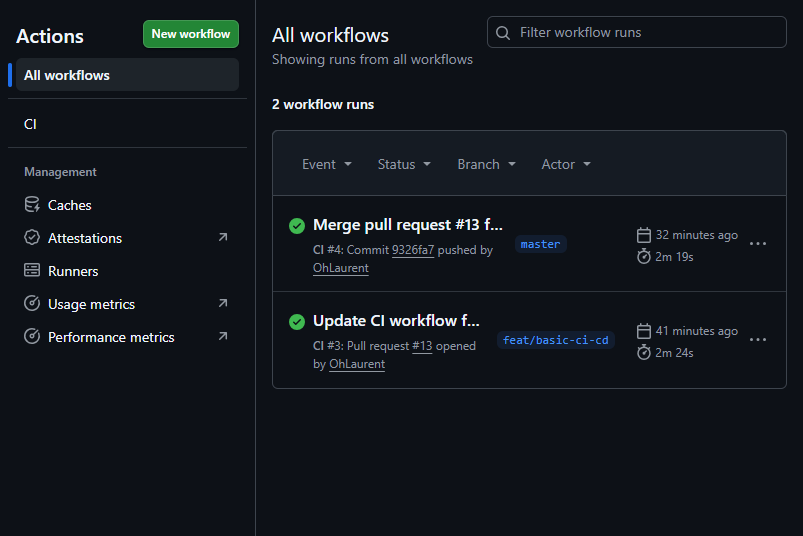

# Heart Disease Prediction — ML Engineering & Data Science Portfolio

End-to-end portfolio project covering the full lifecycle of a predictive model for cardiovascular risk: from data validation and exploratory analysis to a production-ready REST API with drift monitoring, model versioning, and continuous integration.

> **Note:** Exploratory data analysis (EDA) and model experimentation were done in a separate repository:
> [github.com/OhLaurent/Heart_disease](https://github.com/OhLaurent/Heart_disease).
> This repository focuses on taking the best model from that exploration and deploying it as a maintainable, observable, and reproducible system.

---

## 1) What this project demonstrates

From a **Data Science** perspective:
- Feature engineering shared between training and inference (no leakage).
- Hyperparameter tuning with `RandomizedSearchCV` and proper train/validation/test splits.
- Model evaluation with `ROC-AUC` as the promotion criterion.
- Drift detection comparing production distributions vs. training baseline (KS test for numerical, TV distance for categorical).

From an **ML Engineering** perspective:
- Explicit data contract (`config/schema.yaml`) validated by Pandera (pipeline) + Pydantic (API boundary).
- MLflow experiment tracking, model registry, and alias-based promotion (`active`).
- FastAPI serving layer with prediction history persisted in SQLite for audit and observability.
- Async retraining endpoint with job status tracking.
- Reproducible environment via Docker + `uv`, and CI with GitHub Actions.

---

## 2) Dataset

The dataset contains **270 patient records** with 13 clinical features and a binary target.

**Raw data sample (`data/raw/heart_disease.csv`):**

| id | Age | Sex | Chest pain type | BP  | Cholesterol | FBS over 120 | EKG results | Max HR | Exercise angina | ST depression | Slope of ST | Number of vessels fluro | Thallium | Heart Disease |
|----|-----|-----|-----------------|-----|-------------|--------------|-------------|--------|-----------------|---------------|-------------|-------------------------|----------|---------------|
| 0  | 58  | 1   | 4               | 152 | 239         | 0            | 0           | 158    | 1               | 3.6           | 2           | 2                       | 7        | Presence      |
| 1  | 52  | 1   | 1               | 125 | 325         | 0            | 2           | 171    | 0               | 0.0           | 1           | 0                       | 3        | Absence       |
| 2  | 56  | 0   | 2               | 160 | 188         | 0            | 2           | 151    | 0               | 0.0           | 1           | 0                       | 3        | Absence       |

**Feature descriptions:**

| Feature | Type | Valid values | Description |
|---|---|---|---|
| `Age` | int | 1 – 120 | Patient age in years |
| `Sex` | int | 0, 1 | Biological sex (1=male, 0=female) |
| `Chest pain type` | int | 1, 2, 3, 4 | 1=typical angina, 2=atypical, 3=non-anginal, 4=asymptomatic |
| `BP` | int | 50 – 300 | Resting blood pressure (mmHg) |
| `Cholesterol` | int | 100 – 700 | Serum cholesterol (mg/dL) |
| `FBS over 120` | bool | true/false | Fasting blood sugar > 120 mg/dL |
| `EKG results` | int | 0, 1, 2 | 0=normal, 1=ST-T wave abnormality, 2=LV hypertrophy |
| `Max HR` | int | 40 – 250 | Max heart rate achieved during exercise test (bpm) |
| `Exercise angina` | int | 0, 1 | Exercise-induced angina (1=yes, 0=no) |
| `ST depression` | float | 0.0 – 10.0 | ST depression (exercise vs. rest) |
| `Slope of ST` | int | 1, 2, 3 | Slope of peak exercise ST segment (1=up, 2=flat, 3=down) |
| `Number of vessels fluro` | int | 0 – 3 | Major vessels coloured by fluoroscopy |
| `Thallium` | int | 3, 6, 7 | Thallium stress test (3=normal, 6=fixed defect, 7=reversible defect) |
| `Heart Disease` | str | Presence / Absence | **Target** — only in training data, never in inference input |

---

## 3) Architecture

```
Client / Web UI  →  FastAPI (/api/v1/*)
                        │
                        ├── PredictionPipeline  →  MLflow Registry (alias: active)
                        ├── PredictionStore     →  SQLite (predictions.db)
                        ├── DriftMonitor        →  baseline_stats.json (MLflow artifact)
                        └── TrainingPipeline    →  sklearn + RandomizedSearchCV + MLflow
```

---

## 4) Repository structure

```
heart_disease/
    api/
        app.py                # application factory + lifespan
        routes.py             # REST endpoints
        prediction_store.py   # inference history in SQLite
        drift_monitor.py      # drift metrics vs. baseline
        retrain_jobs.py       # async retraining jobs
        schemas.py            # Pydantic contracts
        static/index.html     # web UI for manual testing
    pipelines/
        train.py              # training, evaluation, MLflow logging, promotion
        predict.py            # inference with the active model
        components/
            dataset.py        # data loading + schema validation
            features.py       # feature transforms and X/y split
config/
    schema.yaml               # single source of truth for the data contract
data/
    raw/heart_disease.csv     # raw dataset (270 records, 13 features + target)
tests/                        # unit + integration tests
.github/workflows/ci.yml      # CI: test → Docker build
Dockerfile
docker-compose.yml
```

---

## 5) API Endpoints

Base URL: `http://localhost:8000`

| Method | Path | Description |
|--------|------|-------------|
| POST | `/api/v1/predict` | Predict heart disease risk for one or more patients |
| GET | `/api/v1/predictions/history` | Persisted inference history (filterable by model version) |
| GET | `/api/v1/predictions/drift` | Drift report vs. training baseline |
| GET | `/api/v1/config` | Expose thresholds and constants to the frontend |
| POST | `/api/v1/retrain` | Synchronous retraining |
| POST | `/api/v1/retrain/jobs` | Start an async retraining job |
| GET | `/api/v1/retrain/jobs/{job_id}` | Check async job progress |

---

## 6) Local setup

### 6.1) Install dependencies with uv

```bash
uv sync --extra dev
```

### 6.2) Start the MLflow tracking server

```bash
uv run mlflow server \
  --backend-store-uri sqlite:///mlflow.db \
  --default-artifact-root ./mlruns \
  --host 127.0.0.1 --port 5000
```

### 6.3) Start the API

**Linux/macOS:**
```bash
MLFLOW_TRACKING_URI=http://127.0.0.1:5000 \
uv run uvicorn heart_disease.api.app:app --reload --host 0.0.0.0 --port 8000
```

**PowerShell:**
```powershell
$env:MLFLOW_TRACKING_URI = "http://127.0.0.1:5000"
uv run uvicorn heart_disease.api.app:app --reload --host 0.0.0.0 --port 8000
```

Open:
- Web UI: `http://localhost:8000/`
- Swagger docs: `http://localhost:8000/docs`

### 6.4) Run tests

```bash
uv run pytest -q
```

---

## 7) Docker

```bash
# Build
docker build -t heart-disease:latest .

# Run
docker run --rm -p 8000:8000 heart-disease:latest

# Or with Compose
docker-compose up --build
```

The container starts without a pre-trained model. The API is immediately available; `/predict` returns `503` with an actionable message until you trigger a training run via the web UI or `POST /api/v1/retrain/jobs`.

---

## 8) CI/CD (GitHub Actions)

Workflow: `.github/workflows/ci.yml`
Triggers: `push` and `pull_request` to `main`, `master`, `develop`.

- **`test` job:** Python 3.12 setup → install dependencies → `pytest -q`
- **`build` job** (requires `test`): builds the Docker image to validate the `Dockerfile` is correct

> The pipeline does **not** publish images (`push: false`). It is a build-validation CI, not a registry deployment.

---

## 9) API usage examples

### 9.1) Single prediction

**Request:**
```json
POST /api/v1/predict
Content-Type: application/json

{
  "patient_data": [
    {
      "Age": 55,
      "Sex": 1,
      "Chest pain type": 4,
      "BP": 152,
      "Cholesterol": 239,
      "FBS over 120": false,
      "EKG results": 0,
      "Max HR": 150,
      "Exercise angina": 1,
      "ST depression": 3.6,
      "Slope of ST": 2,
      "Number of vessels fluro": 2,
      "Thallium": 7
    }
  ]
}
```

**Response:**
```json
{
  "predictions": [
    {
      "prediction": "Presence",
      "probability": 0.87,
      "model_version": "3"
    }
  ]
}
```

### 9.2) Start async retraining

```bash
curl -X POST "http://localhost:8000/api/v1/retrain/jobs" \
  -H "Content-Type: application/json" \
  -d '{"n_iter": 20, "cv_splits": 5, "force_replacement": false}'
```

### 9.3) Check retraining status

```bash
curl "http://localhost:8000/api/v1/retrain/jobs/<job_id>"
```

---

## 10) Data contract and governance

All data validation flows from a single source of truth: `config/schema.yaml`.

- **API boundary (Pydantic):** type and range checks on each incoming field before any computation.
- **Pipeline boundary (Pandera):** schema enforcement on the DataFrame during training and inference, with separate modes (`training` vs `inference` — the target column is forbidden in inference mode).
- Labels for the target column are mapped through central constants, eliminating the risk of train/inference inconsistency.

---

## 11) Drift monitoring

After each training run, the pipeline saves `baseline_stats.json` as an MLflow artifact.

The `/predictions/drift` endpoint compares recent production data (from `predictions.db`) against this baseline:

- **Numerical features:** Kolmogorov–Smirnov test + summary statistics (mean, std, min, max).
- **Categorical features:** Total Variation (TV) distance.
- **Final status:** `stable`, `drifted`, or `insufficient_data`.

---

## 12) Testing

The `tests/` suite covers:

- FastAPI application creation and lifespan.
- Schema and validation contracts.
- Prediction flow and history persistence.
- Drift and config endpoints.
- Pipeline components (dataset loading, feature engineering, train, predict).

```
134 passed in ~4s
```

---

## 13) Interface screenshots

### Entry point

The web UI makes it easy to demonstrate the end-to-end flow without needing a REST client. It confirms the project is not just a notebook — there is a working serving layer connected to the model registry.



### Prediction result

A structured clinical input produces a prediction with probability, consuming the active model version registered in MLflow.



### Inference history

Every prediction is persisted with its model version, input data, and output — enabling audit, debugging, and drift analysis.



### Drift monitoring

KS statistics for numerical features and TV distance for categorical ones, compared against the training baseline. Status: `stable`, `drifted`, or `insufficient_data`.



### Async retraining

The async job flow with progress tracking shows the system supports continuous model operation, not just one-shot training.



### MLflow experiments

Parameters, metrics, and artifacts logged centrally — enabling run comparison and reproducibility.



### Model registry and promotion

The `active` alias marks the production version. Promotion is metric-driven (`test_roc_auc`) or forced via `force_replacement`.



### CI pipeline

Automated test and build validation on every push — connecting ML work to software delivery discipline.



---

## 14) Conclusion

This project bridges data science and engineering: the model selection and feature analysis live in the [EDA repository](https://github.com/OhLaurent/Heart_disease), while this repository demonstrates what happens after a model is chosen — packaging it into a system that is observable, testable, versioned, and maintainable. Together, they cover the full journey from raw data exploration to a production-ready prediction service.
